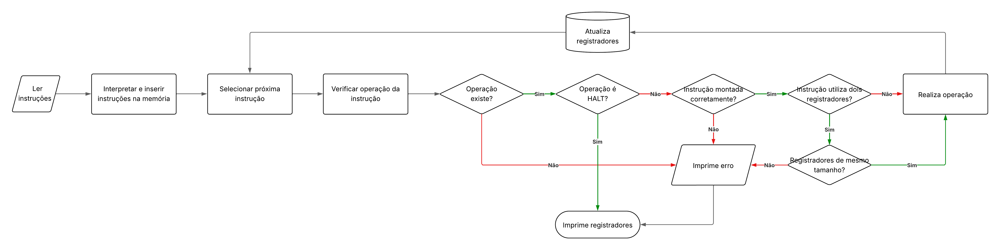

# Simulador de Processador

## 🎯 Objetivo

Este projeto tem como objetivo simular o funcionamento de um processador hipotético, definido com base em um conjunto de registradores e um conjunto de instruções

---

## ⚙️ Funcionalidades

- Entrada com arquivo de texto contendo as instruções em formato hexadecimal
- Simular registradores (8, 16 e 32 bits)
- Simular memória principal (dados e instruções)
- Suportar instruções aritméticas, lógicas, de controle de fluxo e de movimentação de dados
- Utilizar flags para controlar saltos: Carry (C), Overflow (O), Negativo (N), Zero (Z)
- Saída deverá conter o valor de cada um dos registradores após a execução das instruções

---

## 🧠 Registradores

| Registrador | Tamanho  | Código | Descrição                        |
|:-----------:|:--------:|:------:|:---------------------------------|
| R80         | 8 bits   | 0      | Uso genérico                     |
| R81         | 8 bits   | 1      | Uso genérico                     |
| R82         | 8 bits   | 2      | Uso genérico                     |
| R83         | 8 bits   | 3      | Uso genérico                     |
| R160        | 16 bits  | 4      | Uso genérico                     |
| R161        | 16 bits  | 5      | Uso genérico                     |
| R162        | 16 bits  | 6      | Uso genérico                     |
| R163        | 16 bits  | 7      | Uso genérico                     |
| R320        | 32 bits  | 8      | Uso genérico                     |
| R321        | 32 bits  | 9      | Uso genérico                     |
| R322        | 32 bits  | A      | Uso genérico                     |
| R323        | 32 bits  | B      | Uso genérico                     |
| DESV        | 32 bits  | C      | Armazena endereço de desvio      |

---

## 🧾 Instruções

| Instrução         | Descrição                              | Opcode | Exemplo                |
|-------------------|----------------------------------------|:------:|------------------------|
| LOAD_REGISTRADOR  | Carrega registrador no registrador     | 00     | `LOAD R160, R161`      |
| LOAD_CONSTANTE    | Carrega constante no registrador       | 01     | `LOAD R160, 10`        |
| LOAD_MEMORIA      | Carrega valor da memória no registrador| 02     | `LOAD R160, [R320]`    |
| STORE             | Armazena valor na memória principal    | 03     | `STORE [R320], R161`   |
| ADD               | Soma dois registradores                | 04     | `ADD R160, R161`       |
| SUB               | Subtrai dois registradores             | 05     | `SUB R160, R161`       |
| AND               | Realiza operação lógica AND            | 06     | `AND R160, R161`       |
| OR                | Realiza operação lógica OR             | 07     | `OR R160, R161`        |
| XOR               | Realiza operação lógica XOR            | 08     | `XOR R160, R161`       |
| NOT               | Inverte bits do registrador            | 09     | `NOT R160`             |
| JMP               | Salta incondicionalmente               | 0A     | `JMP`                  |
| JZ                | Salta se Z = 1                         | 0B     | `JZ`                   |
| JNZ               | Salta se Z = 0                         | 0C     | `JNZ`                  |
| JL                | Salta se N ≠ O                         | 0D     | `JL`                   |
| JG                | Salta se Z = 0 e N = O                 | 0E     | `JG`                   |
| JC                | Salta se C = 1                         | 0F     | `JC`                   |
| JNC               | Salta se C = 0                         | 10     | `JNC`                  |
| HALT              | Encerra execução                       | 11     | `HALT`                 |

---

## 🔟 Código de máquina

- RegDes (Registrador de destino): Código do registrador que armazenará o resultado da instrução
- RegOrg (Registrador de origem): Código do registrador que será utilizado como operando da instrução
- RegEnd (Registrador de endereço): Código do registrador que será utilizado para referenciar uma posição na memória (deve ser um registrador de 16 bits)
- ValOrg (Valor de origem): Valor constante de 16 bits

| Instrução         | Tamanho | Estrutura da instrução                |
|-------------------|---------|---------------------------------------|
| LOAD_REGISTRADOR  | 2 bytes | [00] [RegDes&#124;RegOrg]             |
| LOAD_CONSTANTE    | 4 bytes | [01] [RegDes&#124;0] [ValOrg] [ValOrg]       |
| LOAD_MEMORIA      | 2 bytes | [02] [RegDes&#124;RegEnd]             |
| STORE             | 2 bytes | [03] [RegEnd&#124;RegOrg]             |
| ADD               | 2 bytes | [04] [RegDes&#124;RegOrg]             |
| SUB               | 2 bytes | [05] [RegDes&#124;RegOrg]             |
| AND               | 2 bytes | [06] [RegDes&#124;RegOrg]             |
| OR                | 2 bytes | [07] [RegDes&#124;RegOrg]             |
| XOR               | 2 bytes | [08] [RegDes&#124;RegOrg]             |
| NOT               | 2 bytes | [09] [RegDes&#124;0]                  |
| JMP               | 1 byte  | [0A]                                  |
| JZ                | 1 byte  | [0B]                                  |
| JNZ               | 1 byte  | [0C]                                  |
| JL                | 1 byte  | [0D]                                  |
| JG                | 1 byte  | [0E]                                  |
| JC                | 1 byte  | [0F]                                  |
| JNC               | 1 byte  | [10]                                  |
| HALT              | 1 byte  | [11]                                  |

---

## 🔍 Observações

- Essa é uma máquina de 16 bits, ou seja, só aceita registradores de 16 bits como referência a posições na memória
- Será utilizada a ordem de bytes big-endian para o código de máquina
- Será simulada uma memória de 65536 bytes

---

## 🔀 Fluxograma

